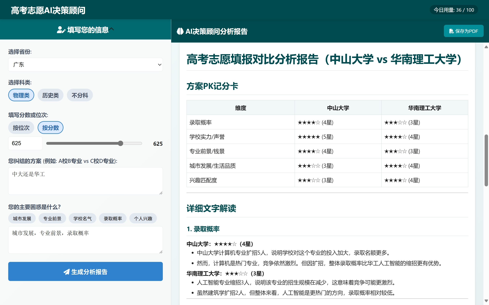

# 高考志愿AI决策顾问 V1.1 🚀

本项目是一个H5单页应用，旨在为面临高考志愿填报最后抉择的考生及家长，提供一份由AI驱动的、结合了最新招生计划的深度分析报告。

V1.1版本在原基础上，新增了**邀请码认证**、**多轮对话**、**IP速率限制**等核心功能，并优化了部署方式，使其能够**完全在GitHub Actions的免费环境中运行**，实现了状态的持久化。

---




## ✨ V1.1 功能特性

- **智能分析报告**:
  - **个性化输入**: 用户可以输入省份、科类、分数/位次，以及最纠结的几个志愿方案和主要困惑。
  - **动态数据结合**: AI会将用户的输入与预置的最新招生计划数据 (`_data/enrollment_data_2025.json`) 相结合进行分析。
  - **深度思考过程**: 在生成报告前，AI会先输出一段被折叠的“思考过程”，展示其分析逻辑，供专业用户参考。
  - **多维度PK记分卡**: 报告的核心是一个Markdown表格，从录取概率、学校实力、专业前景、城市发展等多个维度对用户的方案进行打分和对比。
  - **对话式解读**: 报告采用亲切的对话式口吻，对记分卡的每一项进行详细解读，并提供最终的总结建议。

- **流畅的用户体验**:
  - **流式响应 (SSE)**: 后端通过Server-Sent Events技术，将AI生成的内容以“打字机”效果逐字显示在前端，包括“思考过程”和正式报告，无需等待。
  - **加载动画**: 在AI思考期间，“生成报告”按钮会呈现动态的彩色渐变加载动画，提供明确的视觉反馈。
  - **Markdown实时渲染**: 使用 **Marked.js** 将AI返回的Markdown格式报告实时渲染为格式优美的HTML。
  - **保存为PDF**: 用户可以将生成的完整分析报告一键保存为PDF文件，方便离线查看和分享。

- **安全与控制 (V1.1 新增)**:
  - **邀请码认证**: 用户访问时，会弹出模态窗口要求输入邀请码。只有验证通过后才能与应用交互。邀请码列表在 `_data/users.json` 中配置。
  - **IP速率限制**: 对每个IP地址进行访问频率限制（默认为10次/分钟），防止恶意请求。
  - **每日用量限制**: 继承并优化了每日总使用次数限制功能，通过 `_data/usage.json` 文件进行持久化计数，会在北京时间零点自动清零。

- **多轮对话 (V1.1 新增)**:
  - **会话保持**: 用户在同一次会话中的多次提问会被记录和关联。
  - **上下文理解**: AI在回答新的问题时，会自动参考最近几轮的对话历史（默认为3轮），实现更智能、更连贯的追问和分析。
  - **状态持久化**: 每个会话的历史记录都会被保存在 `sessions/` 目录下，并通过GitHub Actions自动提交回仓库，确保状态不会因服务重启而丢失。

---

## 🛠️ 技术栈

- **后端 (Backend)**
  - **Web框架**: **Flask**
  - **WSGI服务器**: **Gunicorn** + `gevent`
  - **AI模型**: **OpenAI SDK**
  - **状态存储**: **本地JSON文件** (`_data/usage.json`, `_data/users.json`, `sessions/*.json`) - V1.1版本移除了Redis依赖。

- **前端 (Frontend)**
  - **核心语言**: **原生 JavaScript (ES6+)**, **HTML5**, **CSS3**
  - **核心API**: **Fetch API** & **ReadableStream**
  - **辅助库**: **Marked.js**, **jsPDF** & **html2canvas**, **autoComplete.js**

- **开发与部署 (DevOps)**
  - **容器化**: **Docker** & **Docker Compose** (用于本地开发)
  - **CI/CD & 托管**: **GitHub Actions** - 用于在云端环境中**运行和托管**整个应用，并实现状态文件的自动回写。
  - **内网穿透**: **ngrok** - 用于将GitHub Actions内部运行的服务暴露到公网。
  - **测试**: **Pytest** & **Pytest-mock**

---

## 📂 项目结构

```
.
├── .github/workflows/
│   └── run-app-on-actions.yml  # GitHub Actions工作流文件
├── _data/
│   ├── enrollment_data_2025.json  # 预置的招生计划数据
│   ├── usage.json                 # 每日用量计数器 (自动生成/更新)
│   └── users.json                 # 有效邀请码列表
├── sessions/                        # 对话历史记录 (自动生成/更新)
├── tests/
│   └── test_app.py                # 后端自动化测试用例
├── .env.example                   # 环境变量配置模板
├── app.py                         # Flask后端主程序
├── Dockerfile                     # 应用的Docker镜像定义文件
├── index.html                     # 主页面HTML
├── requirements.txt               # Python依赖列表
├── script.js                      # 前端核心逻辑
└── style.css                      # 页面样式
```

---

## 🚀 如何在 GitHub Actions 上免费运行

本项目经过特殊设计，可以“取巧”地利用GitHub Actions的免费额度来作为应用服务器。

### 前提
1.  **Fork本项目**: 将此仓库Fork到您自己的GitHub账户下。
2.  **注册ngrok**: 访问 [ngrok.com](https://ngrok.com) 注册一个免费账户，并在仪表板中找到您的 **Authtoken**。

### 配置步骤
进入您Fork后的GitHub仓库页面，点击 `Settings` -> `Secrets and variables` -> `Actions`，然后点击 `New repository secret` 添加以下 **Secrets**：

1.  **`NGROK_AUTHTOKEN`**: (必需) 粘贴您从ngrok获取的Authtoken。
2.  **`OPENAI_API_KEY`**: (必需) 您的AI服务API Key。
3.  **`OPENAI_API_BASE`**: (必需) 您的AI服务API地址。
4.  **`DAILY_LIMIT`**: (可选) 每日使用总次数上限，默认`100`。
5.  **`RATE_LIMIT_PER_MINUTE`**: (可选) 单IP每分钟请求上限，默认`10`。
6.  **`CONTEXT_TURNS`**: (可选) AI记忆的上下文对话轮数，默认`3`。

### 运行步骤
1.  **进入Actions页面**: 在您的仓库页面，点击 `Actions` 标签页。
2.  **选择工作流**: 在左侧边栏，点击 `Run App via Actions (Manual Trigger)`。
3.  **手动触发**: 点击 `Run workflow` 按钮，保持默认分支，再次点击 `Run workflow`。
4.  **获取访问链接**: 等待约1-2分钟，待工作流运行起来后，点击进入该运行实例，在日志中找到由ngrok生成的一个 `https://....ngrok-free.app` 格式的URL。在浏览器中打开此链接即可访问。

**重要提示**:
- 此方法违反GitHub服务条款，仅供技术演示，随时可能失效。
- 每个任务最长运行6小时，之后服务会自动关闭。
- `_data/usage.json` 和 `sessions/` 目录下的文件会在任务结束时自动提交回仓库，请确保您本地的代码与远程同步（`git pull`）后再进行修改和推送。

---

## 🐳 如何在本地Docker环境启动 (用于开发)

### 前提
1.  **安装 Docker Desktop**: 从 [Docker官网](https://www.docker.com/products/docker-desktop/) 下载并安装。
2.  **配置环境变量**:
    - 复制 `.env.example` 为 `.env`。
    - 在 `.env` 文件中填入您的 `OPENAI_API_KEY` 和 `OPENAI_API_BASE`。

### 一键启动
在项目根目录下，打开终端并运行：
```bash
docker-compose up --build
```
首次构建可能需要几分钟。当看到日志显示 `Listening at: http://0.0.0.0:5000` 时，在浏览器中打开 `http://localhost:5000` 即可使用。
