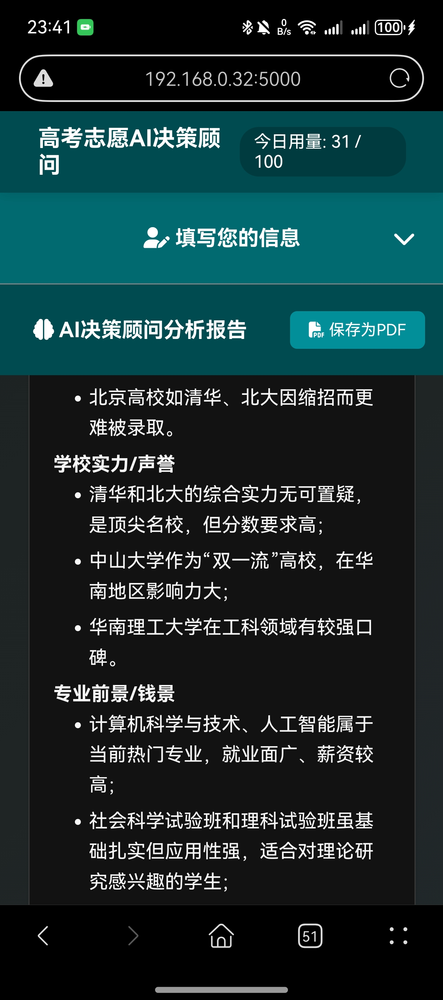

# 高考志愿AI决策顾问 🚀

本项目是一个移动端优先的H5单页应用，旨在为面临高考志愿填报最后抉择的考生及家长，提供一份由AI驱动的、结合了最新招生计划的深度分析报告。应用通过简洁的界面收集用户的基本信息和困惑，调用大语言模型进行智能分析，并以流式的效果实时展示结果，最后支持将报告保存为PDF。

---




## ✨ 功能特性

- **智能分析报告**:
  - **个性化输入**: 用户可以输入省份、科类、分数/位次，以及最纠结的几个志愿方案和主要困惑。
  - **动态数据结合**: AI会将用户的输入与预置的最新招生计划数据（`_data/enrollment_data_2025.json`）相结合进行分析。
  - **深度思考过程**: 在生成报告前，AI会先输出一段被折叠的“思考过程”，展示其分析逻辑，供专业用户参考。
  - **多维度PK记分卡**: 报告的核心是一个Markdown表格，从录取概率、学校实力、专业前景、城市发展等多个维度对用户的方案进行打分和对比。
  - **对话式解读**: 报告采用亲切的对话式口吻，对记分卡的每一项进行详细解读，并提供最终的总结建议。

- **流畅的用户体验**:
  - **流式响应 (SSE)**: 后端通过Server-Sent Events技术，将AI生成的内容以“打字机”效果逐字显示在前端，避免了长时间的等待。
  - **Markdown实时渲染**: 使用 **Marked.js** 将AI返回的Markdown格式报告实时渲染为格式优美的HTML。
  - **便捷的交互组件**:
    - **自动补全**: 在输入纠结方案时，提供基于招生数据的学校和专业名称自动补全。
    - **滑块输入**: 分数和位次可以通过拖动滑块或直接输入数字来设定。
    - **标签点选**: “主要困惑”部分提供了常用标签，点击即可快速输入。
  - **移动端优先**:
    - **响应式布局**: 界面在桌面端和移动端均有良好表现。
    - **可折叠区域**: 在手机等小屏幕设备上，信息输入区会自动变为可折叠的面板，以节省宝贵的垂直空间。

- **实用工具**:
  - **保存为PDF**: 用户可以将生成的完整分析报告一键保存为PDF文件，方便离线查看和分享。
  - **成本控制**: 内置基于Redis的每日API请求次数限制功能，可有效控制AI模型的使用成本。

---

## 🛠️ 技术栈

本项目采用前后端分离但统一仓库的模式，通过Docker进行容器化部署。

- **后端 (Backend)**
  - **Web框架**: **Flask** - 一个轻量级的Python Web框架，用于处理API请求和提供静态文件。
  - **WSGI服务器**: **Gunicorn** - 在生产环境中用于运行Flask应用，配合`gevent`协程worker，高效处理并发和流式I/O。
  - **AI模型**: **OpenAI SDK** - 官方提供的Python库，用于与兼容OpenAI API标准的大语言模型（如Kimi, Moonshot, DeepSeek等）进行交互。
  - **数据库**: **Redis** - 一个高性能的内存键值数据库，在此项目中用于实现API的每日请求计数器。

- **前端 (Frontend)**
  - **核心语言**: **原生 JavaScript (ES6+)**, **HTML5**, **CSS3** - 未使用任何重型前端框架，保持轻量和高效。
  - **核心API**: **Fetch API** & **ReadableStream** - 用于与后端建立SSE连接并实时读取流式数据。
  - **辅助库**:
    - **Marked.js**: 用于将Markdown文本解析并渲染为HTML。
    - **jsPDF** & **html2canvas**: 用于将HTML报告内容转换为PDF文档。
    - **autoComplete.js**: 一个轻量级的自动补全库。

- **开发与部署 (DevOps)**
  - **容器化**: **Docker** & **Docker Compose** - 用于创建标准化的应用运行环境，并一键编排Web应用和Redis数据库的启动、连接和关闭。
  - **测试**: **Pytest** - 一个功能强大且易于使用的Python测试框架，用于后端的单元测试和集成测试。
    - **Pytest-mock**: `pytest`的插件，用于在测试中模拟（mock）外部依赖（如Redis、OpenAI API）。

---

## 📂 项目结构

```
.
├── _data/
│   └── enrollment_data_2025.json  # 预置的招生计划数据
├── tests/
│   └── test_app.py                # 后端自动化测试用例
├── .env.example                   # 环境变量配置模板
├── .gitignore
├── app.py                         # Flask后端主程序
├── docker-compose.yml             # Docker Compose编排文件
├── Dockerfile                     # 应用的Docker镜像定义文件
├── index.html                     # 主页面HTML
├── pytest.ini                     # Pytest配置文件
├── README.md                      # 就是你正在看的这个文件
├── requirements.txt               # Python依赖列表
├── script.js                      # 前端核心逻辑
└── style.css                      # 页面样式
```

---

## 🚀 如何启动

### 前提
1.  **安装 Docker Desktop**: 从 [Docker官网](https://www.docker.com/products/docker-desktop/) 下载并安装。
2.  **配置环境变量**:
    - 复制 `.env.example` 为 `.env`。
    - 在 `.env` 文件中填入你的 `OPENAI_API_KEY` 和 `OPENAI_API_BASE`。
    - (可选) 设置 `DAILY_LIMIT=200` 来调整每日API请求上限（默认100）。

### 一键启动
在项目根目录下，打开终端并运行：
```bash
docker-compose up --build
```
首次构建可能需要几分钟。当看到日志显示 `Listening at: http://0.0.0.0:5000` 时，在浏览器中打开 `http://localhost:5000` 即可使用。

### 如何停止
在运行命令的终端中，按下 `Ctrl + C`。

---

## 🧪 自动化测试

本项目使用 `pytest` 进行后端测试。

**在Docker容器内运行 (推荐)**
1.  **启动服务**: `docker-compose up -d`
2.  **进入容器**: `docker-compose exec web /bin/sh`
3.  **运行测试**: 在容器的shell中，运行 `pytest`。

**在本地运行**
1.  **安装依赖**: `pip install -r requirements.txt`
2.  **运行测试**: 在项目根目录下，运行 `pytest`。
